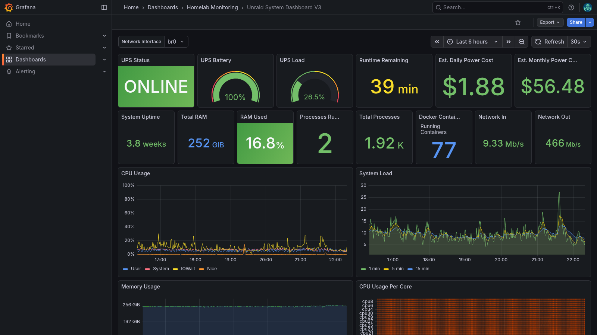
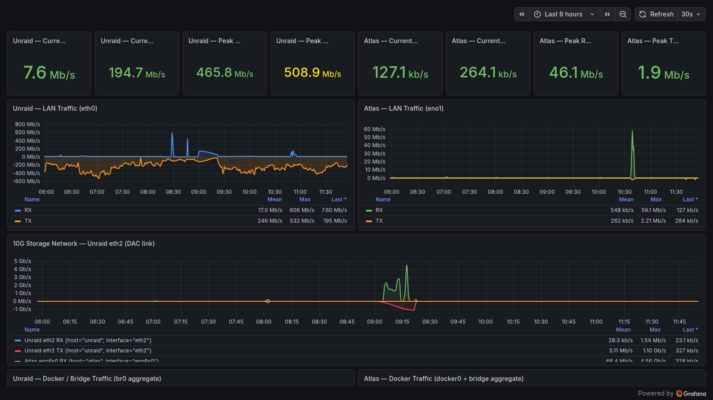
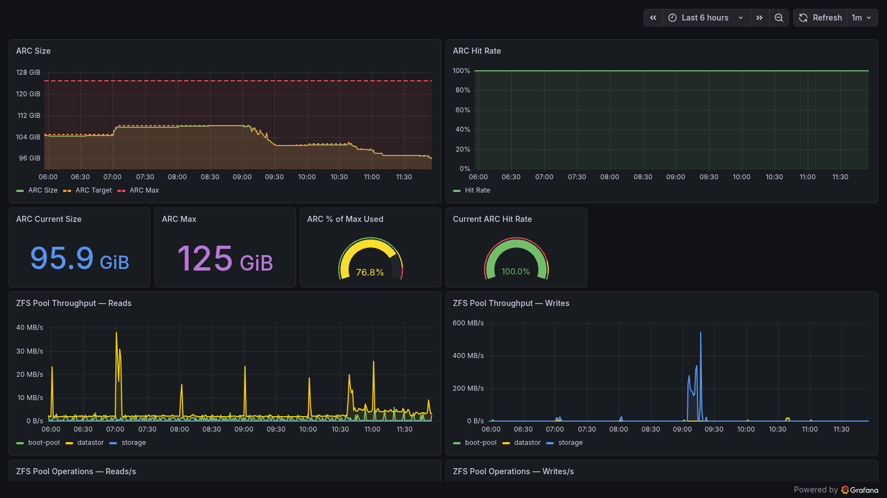

# homelab-monitoring-stack

A production-grade observability stack for a multi-host homelab environment, built on open-source tooling and managed with AI-assisted workflows. This repo documents the architecture, configuration, and build process behind a monitoring setup covering bare-metal servers, NAS systems, Docker containers, and UPS infrastructure.

---

## Stack Overview

| Component | Role |
|-----------|------|
| **Grafana** | Visualization and dashboards |
| **InfluxDB** | Time-series metrics storage |
| **Loki** | Log aggregation |
| **Telegraf** | Metrics collection agent (per-host) |
| **Promtail / Alloy** | Log shipping agents (per-host) |
| **Netdata** | Real-time anomaly detection and ML-assisted alerting |

The Grafana stack (Grafana, InfluxDB, Loki) runs as Docker containers on TrueNAS (Atlas). Telegraf runs on each monitored host and ships metrics to InfluxDB; Promtail/Alloy handles log collection and forwards to Loki. Netdata runs on Unraid for real-time visibility independent of the InfluxDB pipeline.

---

## Infrastructure Monitored

Four hosts are instrumented, each running Telegraf for metrics and Promtail for log shipping:

**TrueNAS (Atlas — monitoring host)**
- Hosts the full Grafana stack: Grafana, InfluxDB, Loki (Docker)
- ZFS pool health, ARC hit rate, capacity
- Drive temperatures across all spindles
- 10GbE and 1GbE network throughput

**Unraid (primary compute host)**
- Intel Xeon E5-2667 v2 (32 threads), 256GB RAM
- Unraid OS 7.x with Docker and VM support
- UPS monitoring (status, load, battery, power cost estimation)
- Per-container CPU/memory tracking via Telegraf

**Claudebox (Debian — AI workspace)**
- GMKTec K11 Mini PC, Ryzen 9 8945HS, Debian 13
- Claude Desktop host with MCP tooling
- Designed to run bare-metal or as a Proxmox VM

**Argus (Debian — monitoring/utility host)**
- Low-power Pentium N3700 mini PC, Debian 13
- Runs Gatus (uptime monitoring), Healthchecks, and supporting services

---

## Dashboards

Thirteen dashboards are currently deployed across three folders in Grafana. Dashboard JSON files are in [`/dashboards`](./dashboards/).







| Dashboard | Panels | Highlights |
|-----------|--------|------------|
| Unraid System Dashboard V3 | 28 | CPU heatmap, UPS cost tracking, Docker resource usage, live syslog |
| Atlas - TrueNAS Monitoring | 13 | ZFS pool status, ARC hit rate, drive temps, 10GbE throughput |
| Atlas — ZFS | — | ZFS ARC size/hit rate, pool read/write throughput |
| Network Traffic | — | Per-host LAN throughput, 10G DAC link between Unraid and Atlas |
| Homelab Log Overview | 13 | Cross-host error rates, top noisy containers, live log feeds |
| Homelab Overview — Netdata | — | Multi-host real-time overview via Netdata |
| Claudebox System Dashboard | — | AI workspace host metrics |
| Unraid Drive Health (SMART) | — | Per-drive SMART data |
| Unraid Array Usage | — | Array utilization over time |
| Unraid System Health | — | High-level health overview |

---

## AI-Assisted Build Workflow

This stack was built and is actively managed using Claude AI as an infrastructure operations tool — not just as a code assistant.

The workflow involves Claude connecting directly to live infrastructure via MCP (Model Context Protocol) integrations:

- **Grafana MCP** — Claude can read datasource metadata, inspect existing dashboards, and create or modify dashboards against the live Grafana API. With the Grafana Image Renderer plugin installed, Claude can also render live panel images directly during a session — making it possible to visually inspect a dashboard, spot a broken panel or layout issue, and fix it without leaving the conversation
- **InfluxDB MCP** — Claude can write time-series data directly into InfluxDB buckets using line protocol, enabling AI-generated metrics, synthetic test data, and instrumentation of the AI workflow itself
- **Netdata MCP** — Claude queries real-time metrics, anomaly detection results, and alert state across monitored nodes
- **Desktop Commander MCP** — file system access, shell execution, and config management on the Claudebox host

In practice this means Claude can query current CPU usage, cross-reference it against Grafana dashboard data, identify gaps in observability, and create or update dashboards to fill them — all within a single conversation. Dashboards in this repo were built through that workflow rather than through manual JSON editing or the Grafana UI.

**Persistent context** is maintained across sessions via two memory systems running on Claudebox: Basic Memory (an Obsidian-compatible markdown knowledge base) and a graph-based knowledge MCP. Infrastructure decisions, configuration context, and accumulated operational knowledge persist between AI sessions rather than being re-established each time. This makes the AI workspace function as a long-term operations partner rather than a stateless assistant.

**Documentation and configuration** produced through this workflow — infrastructure notes, runbooks, Telegraf configs, and project context — are version-controlled in a private GitHub repository. This repo is part of that same practice applied to a public-facing project.

This isn't an AI-generated project in the "paste some code" sense. It's a working example of AI being integrated into an infrastructure operations workflow as a genuine tool.

---

## Repository Structure

```
homelab-monitoring-stack/
├── README.md
├── docs/
│   ├── architecture.md       # component diagram, data flow, design decisions
│   └── ai-workflow.md        # detailed writeup of the MCP-based build process
├── dashboards/
│   ├── README.md             # dashboard index and import instructions
│   ├── unraid-system-v3.json
│   ├── atlas-truenas.json
│   ├── homelab-logs.json
│   └── ...
├── telegraf/
│   └── README.md             # Telegraf config overview and key inputs used
└── screenshots/
```

---

## Skills Demonstrated

- Docker-based service deployment and composition
- Time-series data modeling (InfluxDB)
- Log aggregation pipeline (syslog + container logs → Loki)
- Grafana dashboard development (InfluxQL, LogQL queries)
- ZFS and NAS monitoring
- UPS integration and power cost tracking
- AI/MCP workflow integration for infrastructure management

---

## Related

- [msgraph-entra-toolkit](https://github.com/TedSysOps/msgraph-entra-toolkit) — PowerShell toolkit for Entra ID user lookup via Microsoft Graph API
